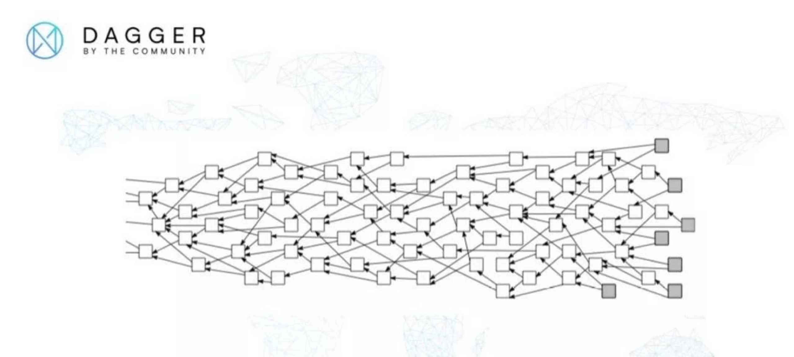
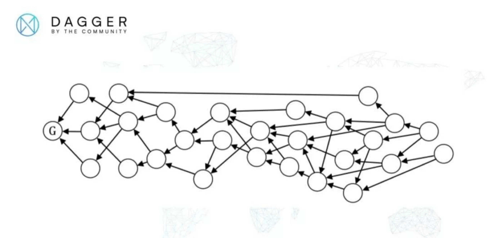
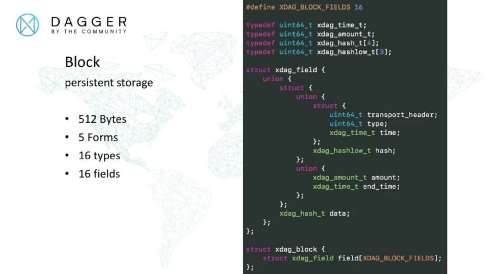
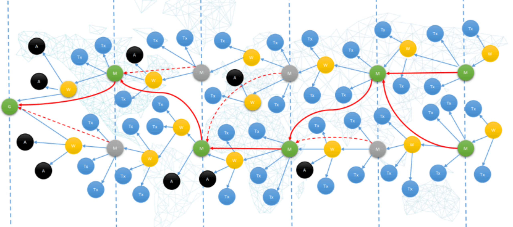

XDAG: A Novel DAG-Based Cryptocurrency

## Introduction

XDAG is an avant-garde distributed ledger technology (DLT) based on the directed acyclic graph (DAG) infrastructure. It is the premier community-driven DAG+POW project that can be mined, with the major network launched in January 2018. XDAG has an approximate maximum supply of 1.446294144 billion without any private placement, initial coin offering (ICO), or project sponsor. Thus, it embodies a genuinely decentralized, efficient, secure, and equitable sentiment, being developed and maintained by blockchain aficionados from across the globe. Even though XDAG is a DAG protocol, its transaction design has similarities to Bitcoin's UTXO, with its development sharing some parallels with Bitcoin as well.

## The Saga of XDAG

XDAG was initiated in September 2017 by a professor of mathematics at a Russian university named Cheatoshi, who was disheartened by the cryptocurrency projects during that time. Therefore, he decided to create a cryptocurrency project that integrated DAG and PoW. Although the development of the project took three months, Cheatoshi failed to launch it in December 2017. However, after several days of debugging, the XDAG network was finally launched in January 2018.

On January 5, 2018, Cheatoshi released the founding post of XDAG in the Bitcointalk forum, declaring his intention to construct an equitable cryptocurrency system based on DAG technology. In those times, Bitcointalk was the most preferred means of communication. In February 2018, Cheatoshi open-sourced the project, allowing the community to contribute and participate. Subsequently, the community transferred the project to Github. However, Cheatoshi vanished, completely transferring management of the project to the community. This experience mimics that of Satoshi Nakamoto.

Our heartfelt gratitude to Cheatoshi.

XDAG is the first DAG that supports mining (IOTA does not employ mining) without pre-mining, ICO or any sponsor or investor. It is continuously developed and maintained by a group of blockchain developers who remain firm in their belief that decentralization remains the paramount ideal.
## Contemporary Hurdles with Decentralized Technology

Despite the advancements in the industry, blockchain technology confronts a plethora of issues that assume critical importance as its implementation scales up. At present, two fundamental difficulties arise:

1. The TPS bottleneck of the blockchain impairs its performance by allowing only a limited number of transactions to be processed simultaneously.
2. The prolonged confirmation time of the blockchain impedes its scalability as users experience tardy transactions coupled with high fees. 

Contemporary Approaches and Potential Mitigation Strategies for Enhancing Decentralized Technology

Currently, approaches to tackling the limitations of blockchain technology include:

1. Layer 1 (Sharding)

   - PoS/DPoS and consensus/Sharding (sharding calculation)

2. Layer 2 (Side Chain)

   - Side Chain/ State Channels/ Multi Chains

Despite the efforts to implement solutions for the defects of blockchain, such as EOS's centralized approach or the current sharding technology in vogue, there are still unresolved issues in side chain technology. This indirectly demonstrates that blockchain-based expansion will face significant difficulties and challenges. DAG technology has emerged as a viable third option for resolution.

DAG is unique in that its data structure differs from that of blockchain and has intrinsic high scalability. IOTA is the most popular DAG-based project, but it still grapples with the problem of centralization. XDAG has introduced PoW, which has been proven to be the optimal consensus system, and exclusively delegates the responsibility of verifying transactions to miners, while retaining the original advantages of DAG.

These challenges pose a significant hurdle to the widespread adoption and utilization of blockchain technology. One feasible mitigation strategy is to adopt alternative consensus algorithms like DAG. DAG is a revolutionary technology that deploys a non-linear structure to ensure the maximum speed of transaction processing, improved security measures, and high scalability.

XDAG, built on a DAG structure, is an innovative technology that intends to address several issues that have impeded the universal acceptance of blockchain technology. This technology is engineered to provide high-speed, secure, and scalable solutions, thereby making it an ideal choice for many applications requiring high throughput and transaction speeds.

XDAG outperforms the traditional blockchain system in many ways. The DAG structure enables XDAG to process numerous transactions simultaneously, significantly increasing the TPS rate. By eliminating the need for miners, XDAG becomes more energy-efficient and faster than other blockchain consensus algorithms. XDAG's confirmation times are much faster, allowing for real-time, high-throughput transactions.

In conclusion, the scalability and efficiency limitations of blockchain technology require attention to enhance its adoption and utilization. Integrating existing or adopting new technologies like XDAG, in addition to applying other mitigation strategies, can revolutionize blockchain technology, offering the potential to become more efficient, secure, and scalable for various applications. Therefore, you can utilize XDAG, built on a DAG structure, to address scalability and efficiency issues in blockchain technology. Adopting alternative consensus algorithms such as XDAG, can revolutionize and enhance the adoption and utilization of blockchain technology.
XDAG Technology: An Overview of DAG Structures

DAG (Directed Acyclic Graph) has been in existence since it was first introduced as a mathematical concept in graph theory and has emerged as a crucial tool in numerous technological domains, with computer technology being no exception. DAG structures, while theoretically more complex than single-chain structures, offer better scalability.

Presently, several public chains in the industry utilize DAG structures, but each implementation has its unique approach and application scenarios, with different understandings of DAG technology playing a significant role.

The various DAG implementations include:

1. NANO, where each account has its chain, and transaction records link different accounts to form a DAG structure.

   

2. IOTA's DAG, where the user evaluates the legitimacy of a transaction based on its height and weight.

   

3. Hashgraph's DAG, which employs a modified gossip algorithm between nodes for transaction propagation, forming a sequence in time, and creating a DAG structure.

   

4. Byteball's DAG, which utilizes witness nodes to amplify the branch's weight and determine the current master chain in the DAG.

   

DAG Implementations and XDAG Technology: Addressing the "Impossible Triangle" Problem

Despite the diverse approaches, DAG implementations presently available do not provide a solution to the "impossible triangle" problem, which is characterized by issues related to decentralization, high TPS, and low confirmation time. In contrast, the XDAG technology, built on an advanced DAG structural model, is engineered to solve the "impossible triangle" problem.

XDAG was purpose-built to alleviate issues associated with scalability, high TPS, and low confirmation time by employing the DAG-based algorithm that incorporates numerous unique features. These include an exclusive consensus model, transaction filtering methods at both ends of reception and transmission, dynamic memory pool allocation, and much more.

XDAG technology offers the potential for blockchain technology to become more efficient, secure, and scalable for various applications.

XDAG aims to revamp the underlying data structure of blockchain technology and adopt a DAG composition. This innovative approach blends PoW consensus algorithm and DAG technology to provide concurrent processing of transactions between different nodes, remarkably enhancing transactions per second (TPS) and reducing confirmation time. The network is also designed to ensure security and fairness.

In the above illustration, A portrays the wallet address block, Tx denotes the transaction block, M embodies the primary block engendered through Proof of Work, and W denotes the witness block.

XDAG's distinct characteristic is that blocks, transactions, and addresses are identical.

The data structure of a block in XDAG is illustrated in the above diagram. This structure is utilized to achieve consistent storage of data. The block structure comprises of 16 structures, each having a name of xdag_field. Each xdag_field comprises of a structure and a union.

The transport_header is employed to designate the sequence number during transmission and to store the address of the succeeding block during post-reception processing.

The 64-bit Type field conveys the type of 16 fields in a block, and is split into 16 sections, each consisting of four bits, thus signifying half a byte. Consequently, four bits are capable of indicating 16 types, with the type field indicating the corresponding type for each four bits.

Time is utilized to indicate the time of block generation, with the format being expressed in 1/1024 seconds, with one second expressed as 2^10. Time is also invoked as the starting time point of the request time range during data exchange between nodes.

Hash represents a 24-byte truncated hash, typically the truncated hash of another block.

Amount serves as a quantitative value in Cheato, intended for recording the number of XDAGs. Cheato is the basic unit of XDAG, with 1 XDAG containing 2^32 Cheato.

End_time represents the concluding time point of data exchange between nodes for the request time range. Data is a 32-byte hash.

Blocks in XDAG are autonomously generated by each node and wallet, without interference from other sources. This basic design configuration ensures the independence of block processing, laying the groundwork for the high transactions per second (TPS) discussed in subsequent sections.

Technological benefits of XDAG are outlined below:

1. XDAG represents the first public chain founded on DAG technology to achieve PoW. This amalgamation of the high concurrency of DAG with the security and decentralization of PoW has resolved the "impossible triangle" problem in blockchain technology.

2. In XDAG, the block, transaction, and address are interchangeable. This unique design has negated the possibility of lost coins owing to incorrect addresses during the transfer process.

3. XDAG has low transaction fees and high TPS.

4. Through unique technical approaches, XDAG has resolved several challenges that could arise in the blockchain system, such as double-spending, uncontrollable transaction time, centralization, 34% attacks, and 51% attacks.

5. The founders of XDAG have planned and designed their own operating systems such that some of the ongoing experiments in Bitcoin and Ethereum can also be carried out using XDAG.

The concepts illustrated in the figures below underpin the aforementioned points.

In the concept of the main chain in DAG, transactions need sorting; otherwise, the problem of double-spending cannot be solved. Inside the main chain of XDAG, there are slices according to time, and each slice will be packaged for transactions. Green is the main block on the main chain, yellow is the witness block, blue is the transfer transaction, and black is the address block.

XDAG is similar to Bitcoin and is also the model of UTXO. The graphics may not be the same, but the essence is the same. The block in the figure is the connection block mentioned earlier, Tx0, Tx1, Tx2 are the real transactions, and Block A-D are the addresses.

The above figure shows that there are Merkle trees in the blockchain and a similar structure in XDAG.

The green main block in the above figure stores the hash of the transaction, similar to the Merkle tree. The calculation of PoW in XDAG is variable. Miners add the received transactions to their own hash calculation, each node does the calculation, and finally competes for the strongest calculation power to generate the main chain block.

In the above figure, calculating the local block/transaction hash is done layer by layer, and then filled in the new block (Main Block 2). After that, the sha256 calculation is done, which involves iterative calculation and obfuscation. For sending the result, only the calculated sha256 value needs to be sent instead of sending all the transactions, saving bandwidth resources. Thus, the miner only needs to continue to calculate the sha256, finally find the minimum hash to get the nonce and determine the new main block on the main chain, and in this way, the structure of the main chain is formed.

Note: To ensure fairness, the XDAG mining algorithm has been changed from sha256 to the RandomX algorithm.
How to Resolve Double Spend

This can be illustrated using diagrams as shown below:

If a transaction is generated between A1 and A2, a new connection block is generated to confirm the transaction, and the connection block is generated from the miners.

Suppose there are 10 XDAGs at address A1, and A1's wallet is maliciously copied twice, and two transfers are initiated at the same time. One transfer, Tx1, transfers 5 XDAGs from A1 to address A2, and the other, Tx2, transfers 7 XDAGs from A1 to address A2. The two transfers total 12 XDAGs, which exceeds the original 10 XDAGs for the A1 address, which is a typical double spend.

The logic in XDAG detection is that when the node receives Tx1 and Tx2 at the same time, the node generates a W block that references both Tx1 and Tx2. According to the stable ordering rules, Tx2 will be populated with fields with smaller order numbers when referenced by the W block. Therefore, Tx2 is processed first, and Tx1 is processed later, thus verifying that the Tx1 spend is a double spend. As a result, the internal block will mark the transaction block pointed to by the hash as rejected, and the transaction block Tx1 is recorded in the DAG forever and is not deleted.

Because users can choose which node to send their transactions to for verification, it is assumed here that if both transactions are sent to the same node, the first transaction referenced by the connection block is a valid transaction, and the second is an invalid transaction, solving the simple double spend problem in this way.

Suppose the premise is the same as before. There are 10 XDAGs at address A1, and A1's wallet is maliciously copied twice, and two transfers are initiated at the same time. One transfer, Tx1, transfers 5 XDAGs from A1 to address A2, and the other, Tx2, transfers 7 XDAGs from A1 to address A2. The two transfers total 12 XDAGs, which exceeds the original 10 XDAGs for the A1 address, which is a typical double spend.

But this time, the situation has changed. The person maliciously used technical means to connect the wallet to a different node, thus creating a double spend detection between different nodes.

At this point, PoW consensus comes into play, and a master block is generated every 64 seconds in XDAG. By comparing the difficulty of the master blocks, M1' and M1'', it is determined that M1'' is more challenging. Therefore, M1'' referenced block Tx2 in sorting priority over M1' referenced Tx1, so that Tx1 is detected as a double spend. As a result, the transaction block pointed to by the hash is marked as rejected in the internal block, while the transaction block Tx1 is recorded in the DAG forever and will not be deleted.

If there is a user who wants to cheat and sends these two transactions to different
XDAG boasts of high transactions per second (TPS).

The reason behind XDAG's remarkable TPS is due to the fact that the DAG is divided into numerous localized blocks. This approach allows for a high TPS, akin to the effects observed in sharding computation.

The diagram provided in the figure below depicts a more detailed DAG structure of XDAG, with the omission of wallet address blocks, for the sake of simplicity.

In the diagram, nodes denote different nodes, M denotes the main block mined by PoW, W denotes an additional block, which I named a witness block, and Tx is the transaction block.

Different nodes receive their transaction blocks separately, and the act of stitching the transaction blocks into the DAG is less coupled among them. The connection between them is established through the data interaction between nodes, which enables different nodes to absorb higher concurrency and achieve a high TPS.

At the same time, a master block is generated every 64 seconds through PoW, which greatly reduces the transaction confirmation time of decentralized public chains, and can be confirmed in 1 to 2 minutes on average.
## Advantages of XDAG

1. XDAG employs the DAG + PoW approach as a means of surmounting and resolving the constraints of conventional blockchain technology, thereby significantly amplifying the scalability of the blockchain system. XDAG embodies attributes of decentralization and high TPS while maintaining support for PoW mining. The XDAG network is capable of achieving high TPS even under highly decentralized conditions such as with PoW consensus, with transaction volume reaching several thousand TPS.

In theory, the DAG methodology enables vast trading blocks between Main Blocks, but the actual situation is still contingent on network transmission swiftness and network equipment performance. Peak transaction volume has reached several thousand TPS, while the transaction limit has not been gauged due to network and hardware conditions.

2. Modernization of blockchain technology is evident in XDAG. A block in XDAG is also a transaction, and the address generated by the wallet creates a transaction in the network: Block = Transaction = Address. With the founders' thoughtful consideration in designing the operating system, some of the ongoing experiments in Bitcoin and ETH can be realized in XDAG.

3. Rapid block generation, swift transfer, and no commission. The infrastructure of DAG technology affords XDAG a block generation rate of every 64 seconds, with transfer usually completed within approximately 3 minutes and commission fees at zero. This is achievable in the state of PoW decentralization to achieve high TPS and prompt transfer.

4. XDAG can achieve financial security, absent of black hole addresses. As every wallet address and transaction record in XDAG are blocks, every wallet must exist in the main network, ensuring that in the situation where an attempt is made to transfer funds to a non-existent address, such endeavours will fail, assuring no issue of transfer to a black hole address.

5. Originality is intrinsic to XDAG. The implementation of DAG + PoW in XDAG is revolutionary and pioneering, being the earliest (Note: validate time through BitcoinTalk's Genesis post), with original code. XDAG provides C language and Java.

6. Authentically community-driven. No project sponsor, no pre-mining, no ICO. Every XDAG is mined and extracted by miners in a fair distribution. The volunteer-based community team is composed of enthusiasts from around the world, propelling the evolution of XDAG.

7. XDAG affirms ASIC resistance and CPU mining. By adopting the RandomX mining algorithm, greater numbers of CPU users are incentivized to engage in mining, henceforth promoting fairness.

XDAG exemplifies support for numerous decentralized scenario applications, allowing for seamless porting of more applications to the XDAG network, bearing freedom from congestion and prohibitive fees associated with other public chains.
## The XDAG Community

XDAG enthusiasts have established an autonomous community team that has progressed from freeform development to methodical advancement. In a step-by-step process, XDAG achieves rapid advancement, all the while with the community growing ever stronger.

Presently, the XDAG community autonomy team comprises over 20 members spanning the globe, with each member working on diverse aspects, such as XDAG JAVA/C, PC wallet, Android wallet, IOS wallet, mining algorithm, mining software, network protocols, community website, testnet, community operations, and other sundry tasks.

Despite the prodigious workload, an autonomous community demands more XDAG enthusiasts to partake in the team. The community has formulated a proposal mechanism (https://trello.com/b/nlSBXa2d/xps), as well as an incentivization mechanism, enticing more developers to join the community by utilizing the "Reward Task" featured on the community website at https://xdag.io/. Anyone may propose improvements on XPS and sponsor development costs.
Here's an example:

## XDAG Links

Official Website: xdag.io

Bitcointalk: https://bitcointalk.org/index.php?topic=2552368.0

XDAG Whitepaper: https://github.com/XDagger/xdag/blob/master/WhitePaper.md

Github: https://github.com/XDagger

Blockchain Explorer: https://explorer.xdag.io/

Exchanges: coinex.com
## Welcome to XDAG Community

Discord: https://discord.gg/Nf72gd9

Telegram: https://t.me/dagger_cryptocurrency

Twitter: https://twitter.com/XDAG_Community

WeChat: xdag_dev